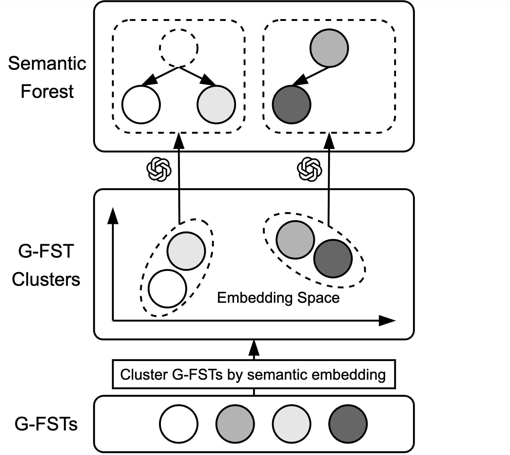

# SemForest: Semantic-Aware Ontology Generation with Foundation Models

This repository contains the codebase for our research on automatic semantic forest ontology construction using Large Language Models (LLMs).

---

## 🧠 Abstract

Functional Semantic Types (FSTs) enrich column-level semantics by pairing type information with executable logic for data transformation and validation. However, to our best knowledge, the only existing FST generation method relies primarily on name-based merging, resulting in flat, unstructured hierarchies that do not align with real-world semantic structures. We introduce SemForest, a framework that constructs a tree-structured semantic forest of FSTs. SemForest produces the ontology with interpretable semantic meaning by clustering related types in embedding space, and leveraging large language models to organize them into hierarchical trees. The resulting ontology improves interpretability and accelerates semantic retrieval through hierarchical navigation. Experiments on three public data universes demonstrate that SemForest improves retrieval recall while reducing search time compared to the existing baseline.

---

## 🖼️ System Overview



---

## 📦 Setup

### 🔧 1. Install Environment

We use `conda` for dependency management. Run:

```bash
conda env create -f environment.yml
conda activate semforest
```

### 🔑 2. Set Your OpenAI API Key

```bash
export OPENAI_API_KEY=your-api-key
```

---

## 📜 Data Preparation

Organize your data under the assets/ directory like so:

```
assets/{data_universe_name}/tables/{product_name}/{table_name}.csv
```

Example:

```
assets/biodivtab/tables/product1/table1.csv
```

We provide a sample data universe [`BiodivTab`](https://zenodo.org/records/5584180).

> **Note:** For demonstration purposes, we made adaptations to this dataset, including renaming products and selecting a subset of tables.

---

## 🌲 Building Semantic Forests

```bash
bash build_forest.sh biodivtab
```

Forests are stored at:

```
assets/biodivtab/forest/
```

---

## 📊 Benchmark Construction

To support recall-based evaluation and ensure reproducibility of semantic retrieval tasks, we release our own benchmark datasets for both joinability and concatenation evaluations.

```
benchmark/data_universe_name/
├── {data_universe_name}_source/   # Source data universe
├── {data_universe_name}_query/    # Query data universe
├── {data_universe_name}_join/     # Ground truth for joinability
├── {data_universe_name}_concat/   # Ground truth for concatenation
```

To download the benchmark data, run:

```bash
gdown 1w3PqXI8JSPjfYHUwiJUocYBYQhmeCb7A
```

---

## 🧱 Project Structure

```
SemanticForest/
├── assets/                      
├── figures/                     
├── .gitignore                  
├── build_forest.py             # Main script to launch forest building
├── build_forest.sh             # Shell wrapper for forest building
├── code_parsing.py             # Parsing and standardizing FSTs
├── environment.yml             # Conda environment setup
├── forest_utils.py             # Utilities for semantic forest
├── pipeline_forest.py          # Forest generation pipeline logic
├── prompt_utils.py             # Helpers for prompt crafting and token counting
├── README.md                   # Project documentation
```

---

## 📊 Logging and Results

Graph build stats:

```
assets/graph_stats.csv
```

Each record logs token usage, API calls, runtime.

---

## 📚 Citation

Coming soon — citation info will be added upon paper publication.

---

## 🙏 Acknowledgments

Some components in this repository are adapted from open-source contributions by Two Sigma Open Source, LLC under the Apache 2.0 License. See license headers in relevant files for details.
